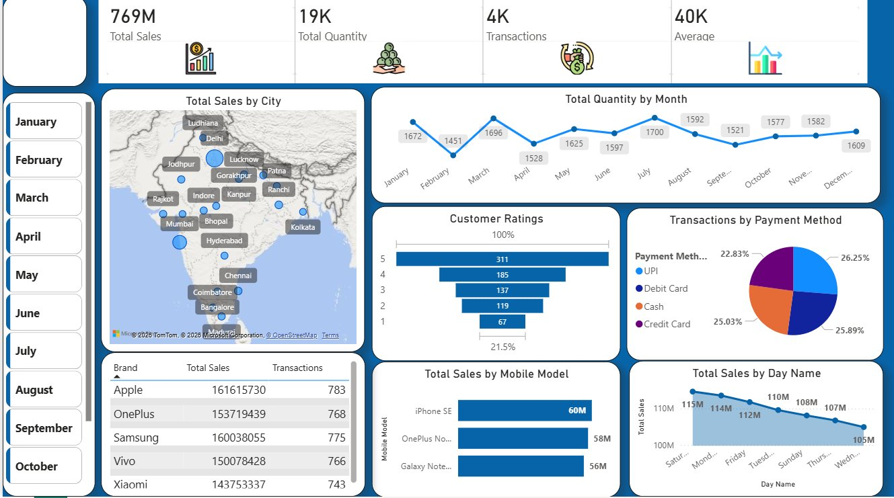

# 📱 Mobile Sales Intelligence Dashboard – Power BI

> An interactive Power BI dashboard providing end-to-end visibility into mobile phone sales performance across Indian cities, brands, payment methods, and time periods.

---

## 📊 Dashboard Preview



---

## 1. 🏷️ Project Title

**Mobile Sales Intelligence Dashboard**

---

## 2. 📝 Overview

This Power BI dashboard delivers a comprehensive, interactive view of mobile phone sales data across major Indian cities. It consolidates key metrics — including total revenue, transaction volumes, customer ratings, and quantity sold — into a single, visually intuitive interface. The dashboard enables stakeholders to monitor business performance at a glance and drill down into granular details by brand, model, city, payment method, month, and day.

---

## 3. 🧩 Business Problem

The mobile retail industry in India is highly competitive, with sales spread across multiple cities, brands, and distribution channels. Businesses often struggle with:

- Lack of a unified view of sales performance across regions
- Difficulty identifying best-performing brands, models, and time periods
- No clear understanding of customer satisfaction trends
- Inability to compare payment method preferences across the customer base
- Challenges in tracking daily and monthly sales fluctuations in real time

---

## 4. 🎯 Objective / Goal

The primary goals of this dashboard are to:

- Provide a **single source of truth** for mobile sales performance
- Enable **data-driven decision-making** for sales, marketing, and inventory teams
- Identify **top-performing brands, models, and cities** to optimize focus areas
- Analyze **customer satisfaction** through rating distributions
- Understand **payment method trends** to align with customer preferences
- Detect **seasonal patterns** in sales volumes for better forecasting

---

## 5. 💡 Key Insights

- **Total Revenue:** ₹769M with 19K units sold across 4K transactions
- **Average Transaction Value:** ₹40K per transaction
- **Top Brand by Revenue:** Apple (₹161.6M), closely followed by Samsung (₹160M) and OnePlus (₹153.7M)
- **Top-Selling Model:** iPhone SE (~₹60M), followed by OnePlus Nord (~₹58M) and Galaxy Note (~₹56M)
- **Peak Sales Months:** January (1,672 units) and March (1,696 units) showed the highest quantity sold
- **Lowest Sales Month:** April (1,528 units) — indicating a potential seasonal dip post Q1
- **Best Sales Day:** Saturday drives the highest revenue (₹115M), with Wednesday being the lowest (₹105M)
- **Payment Methods:** Nearly evenly split — UPI (26.25%), Credit Card (25.89%), Cash (25.03%), Debit Card (22.83%)
- **Customer Ratings:** The majority of customers rated their experience 5 stars (311 responses), indicating strong overall satisfaction
- **Geographic Spread:** Sales are distributed across 20+ major Indian cities including Delhi, Mumbai, Bangalore, Hyderabad, Kolkata, and Lucknow

---

## 6. 🛠️ Tools & Technologies Used

| Tool | Purpose |
|------|---------|
| **Microsoft Power BI** | Dashboard development, data modeling, and visualization |
| **Power Query (M Language)** | Data transformation and cleansing |
| **DAX (Data Analysis Expressions)** | Custom KPI calculations and measures |
| **OpenStreetMap / Bing Maps** | Geographic visualization of city-level sales |
| **Excel / CSV** | Underlying data source (assumed) |

---

## 7. ✨ Features / Highlights

- **📅 Month-wise Filter Panel** — Slicer on the left allows filtering the entire dashboard by specific months (January through December)
- **🗺️ Interactive Map** — Geographic bubble map showing Total Sales by City across India
- **📈 KPI Cards** — At-a-glance metrics for Total Sales, Total Quantity, Transactions, and Average Transaction Value
- **📊 Line Chart** — Monthly quantity trend enabling seasonality analysis
- **🏷️ Brand Performance Table** — Side-by-side comparison of Total Sales and Transactions per brand
- **⭐ Customer Ratings Chart** — Horizontal bar chart showing distribution of 1–5 star ratings
- **🥧 Payment Method Pie Chart** — Breakdown of transactions by UPI, Debit Card, Cash, and Credit Card
- **📱 Top Models Bar Chart** — Horizontal bars ranking mobile models by total revenue
- **📅 Day-wise Sales Chart** — Area chart revealing which days of the week generate the most revenue
- **Full interactivity** — Cross-filtering across all visuals for deep-dive analysis

---

## 8. 🚀 How It Helps

This dashboard empowers various business stakeholders to make smarter, faster decisions:

- **Sales Managers** can identify underperforming regions or brands and take corrective action
- **Marketing Teams** can plan campaigns around high-revenue days (weekends) and peak months (Q1)
- **Inventory Planners** can forecast demand by model and city to avoid stock-outs or overstock
- **Finance Teams** can track revenue trends and average transaction values over time
- **Product Teams** can use customer ratings data to evaluate model satisfaction and quality
- **Payment Partners** can understand customer payment preferences to design better offers

---

## 9. ✅ Conclusion

The **Mobile Sales Intelligence Dashboard** transforms raw sales data into actionable business intelligence. By offering a 360° view of sales performance — from city-level geography to model-specific revenue and customer satisfaction — this dashboard serves as a powerful decision-support tool for any mobile retail business operating in the Indian market. It eliminates guesswork, speeds up reporting cycles, and enables proactive rather than reactive business strategies.

---

## 📁 Repository Contents

```
📦 Mobile-Sales-Dashboard
 ┣ 📊 Mobile_Sales_Dashboard.pbix   ← Power BI dashboard file
 ┣ 🖼️ Dashboard_Overview.png        ← Dashboard screenshot
 ┗ 📄 README.md                     ← Project documentation
```

---

## 🔗 Connect

- **GitHub:** [harshkhandelwal04](https://github.com/harshkhandelwal04)

---

> *Built with Power BI | Data-Driven Insights for the Mobile Retail Industry*
